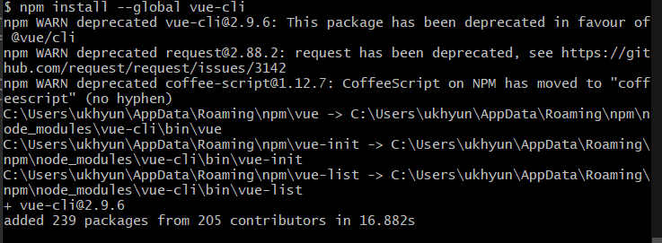
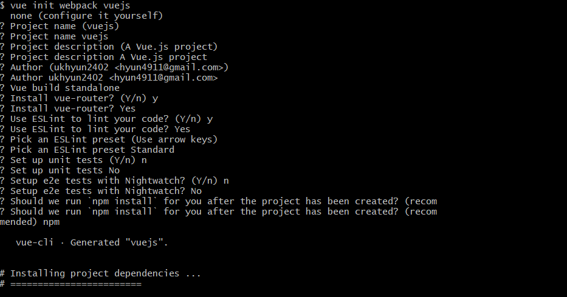
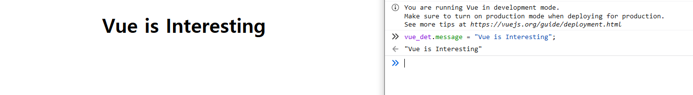

# Vuejs
VueJS는 오픈소스이며 혁신적인 Javascript 프레임워크입니다. 이를 통해 상호 유동적인 웹 인터페이스를 만드는데 사용됩니다. VueJS는 간단하게 웹 개발을 할 수 있는 유명한 프레임워크입니다. VueJS는 view Layer에 초점을 맞추고 있습니다. 이는 큰 프로젝트로 특별한 이슈 없이 쉽게 통합할 수 있습니다.<br/> VueJS의 설치는 매우 쉽게 시작할 수 있습니다. 어떤 개발자든지 쉽게 이해할 수 있으며,*build interactive web interfaces in a matter of time.*VueJS는 구글 직원인 Evan You에 의해 만들어졌습니다. 2014년 2월에 첫 release가 나왔으며 GitHub에서 약 64,828개의 별을 받았습니다. 

## Feature
밑에 나오는 다양한 기능들이 VueJS와 함께라면 이룰 수 있습니다.

### Virtual DOM
VueJS 가상의 DOM을 사용하는 것으로 만들어집니다. 이 가상의 DOM은 React, Ember 등에서 사용되는 것입니다. 다른 것은 DOM을 만드는 것 대신에 모형의 DOM을 만드는 데에 있습니다. 이는 JavaScript의 데이터 형식의 폼에서 유래되었습니다. 어떠한 변화를 통해 만들어졌더라도, Javascript의 데이터 구조로 만들어졌으며, 후에 기존의 데이터 구조와 비교를 할 것입니다. 마지막 변화는 DOM의 변화입니다. 이 또한 후에 볼 것입니다. 이는 최적화 하는데에 좋으며, 빠르고 쉽게 변화가 가능합니다.

### Data Binding
데이터 바인딩 기능은 조작 또는 HTML attribute에 값을 할당하는데에 도움이 될 것입니다. 또한 style의 변화 클래스 부여 등 역시도 도움이 될 것입니다. 이를 **v-bind**라 부르며 VueJS에서 사용가능합니다.

### Components
컴포넌트는 VueJS에 기능 중 중요한 기능입니다. 이는 커스텀 element를 만드는데에 사용됩니다.

### Event Handling
**v-on**은 DOM element에 이벤트를 설정할 수 있는 기능을 말합니다.

### Animation/Transition
VueJS는 다양한 Transition를 HTML에 적용하는 방법을 가지고 있습니다. 또한 기본적으로 가지고 있는 Transition 컴포넌트를 가지고 있습니다. 또한 third party 애니메이션 라이브러리를 쉽게 추가할 수 있습니다.

### Computed Properties
이 기능은 VueJS에서 중요한 기능 중 하나입니다. 이 기능은 UI element의 변화와 중요한 연산의 성능을 도와줍니다?. 이를 위해 추가적인 코딩이 필요없습니다.

### Templates
VueJS는 HTML기반의 템플릿을 제공합니다. 이 템플릿은 Vue 인스턴스 데이타 돔에 바인드됩니다. Vue는 템플릿을 가상의 DOM Render function으로 컴파일합니다. 이를 render functions 템플릿으로 만들 수 있으며 render function 템플릿으로도 바꿀 수 있습니다.

### Directives
VueJS는 v-if, v-else, v-show, v-one, v-bind, v-model과 같은 기본적인 built-in을 가지고 있으며, 이는 프론트엔드에서 다양한 역할을 수행합니다.

### Watchers
Whatcers는 데이터의 변화에 적용할 수 있습니다. (예를 들어 폼의 input element들) 이때 우리는 어떠한 추가적인 이벤트를 설정할 필요도 없습니다. Watcher는 어떠한 데이터든지 빠르게 간단하게 관리합니다.

### Routing
Navigation between pages is performed with the help of vue-router

### Lightweight
VueJS는 매우 가볍고 빠르게 동작합니다.

### Vue-CLI
VueJs는 CLI를 이용해 설치할 수 있고 vue-cli를 이용해 프로젝트를 쉽게 빌드할 수 있습니다.

[원글](https://www.tutorialspoint.com/vuejs/vuejs_overview.htm)

# VueJS - Environment Setup
VueJS를 설치할 수 있는 방법은 다양합니다. 전부를 소개할 수는 없고 몇가지 방법에 대해서만 아래에 설명하도록 하겠습니다.

## Using the \<script> tag directly in HTML file
```html
<html>
   <head>
      <script type = "text/javascript" src = "vue.min.js"></script>
   </head>
   <body></body>
</html>
```
https://vuejs.org/v2/guide/installation.html 왼쪽의 링크를 따라 홈페이지를 가면 vue.js를 다운받을 수 있습니다. 이 때 두가지 버전을 사용할 수 있는데 하나는 프로덕션 버전(Production version)과 개발 버전(Development version)이 있습니다. 개발 버전은 최소화 되어 있지 않으며 반면에 프로덕션 버전은 최소화 되어있습니다. 개발 버전은 프로젝트 개발 중에 에러와 디버그를 통해 도움을 받을 수 있습니다.

### Using CDN
큰 규모의 응용프로그램과 VueJS가 함께할 때에는 npm package를 이용해서 설치하는 것을 추천합니다. Browserify와 Webpack과 같은 필요한 tool들이 함께 설치되기 때문입니다. 이들은 개발을 하는데에 있어 도움이되며 다음과 같은 명령어를 통해 설치할 수 있습니다.
```bash
$npm install vue
```

### Using CLI Command Line
CLI를 이용해서 설치할 수도 있습니다. CLI를 통해 설치하고 싶다면 다음과 같은 방법을 통해 설치d할 수 있습니다.
```cli
> npm install --global vue-cli
```


설치가 완료되면 VueJS의 버전을 보여줍니다. 설치는 시간이 좀 걸립니다.


다음의 코드는 Webpack을 이용해 프로젝트를 만드는 것을 보여줍니다.

```bash
$vue init webpack myproject
```

시작하기 위해서는 다음의 명령어를 입력하세요

```
cd myproject
npm install
npm run dev
```
위의 명령어를 실행한 후
http://localhost:8080 으로 접속하면 Vue.js 홈페이지를 볼 수 있습니다.

[원글](https://www.tutorialspoint.com/vuejs/vuejs_environment_setup.htm)

# VueJS - Introduction([원글](https://www.tutorialspoint.com/vuejs/vuejs_introduction.htm))
Vue는 유저 인터페이스를 위한 JavaScript 프레임워크입니다. 이 프레임워크의 핵심 부분은 view layer에 있으며 이는 이해하기 매우 쉽습니다.

Vue는 기본적으로 frontend 개발에 초점이 맞추어져 있으며, 이후 많은 HTML, Javascript, CSS에 대해서 다루게 될 것입니다. 더 이해하기 쉽게 간단한 예제도 주어질 것입니다.

다음의 예제는 개발 버전을 사용한 것입니다.

```html
<!-- index.html -->
<html>
   <head>
      <title>VueJs Introduction</title>
      <script src="https://cdn.jsdelivr.net/npm/vue/dist/vue.js"></script>
   </head>
   <body>
      <div id = "intro" style = "text-align:center;">
         <h1>{{ message }}</h1>
      </div>
      <script type = "text/javascript">
         var vue_det = new Vue({
            el: '#intro',
            data: {
               message: 'My first VueJS Task'
            }
         })
      </script>
   </body>
</html>
```
결과는 다음과 같다.


>원본과 다르게 여기서는 다음과 같은 방법을 이용해서 Vue.js를 인클루드한다.
>```html
><script src="https://cdn.jsdelivr.net/npm/vue/dist/vue.js"></script>
>```
>이렇게 할 경우 http://localhost:8080으로 들어가도 보이지 않으며, 보고 싶은 경우 HTML파일을 브라우저로 끌어서 넣은 후 볼 수 있다.
### 코드 설명
body 태그안에 속해있는 아래의 div는 "My first VueJS Task"를 브라우저 안에서 표시할 것입니다.
```html
<div id = "intro" style = "text-align:center;">
   <h1>{{ message }}</h1>
</div>
```
또한 *{{}}* 키워드에 메시지를 넣음으로 써, 안의 데이터가 브라우저에 반영되어 표시됩니다. DOM객체 메시지의 값을 얻기 위해서 다음 과 같은 코드가 필요합니다.
```js
         var vue_det = new Vue({
            el: '#intro',
            data: {
               message: 'My first VueJS Task'
            }
         })
```
위에 코드는 Vue Instance에서 id가 있는 DOM 객체 즉, el: #intro를 얻음을 말합니다. 그리고 그곳에 message 데이터인 "My first VueJS Task"가 반영되는 것입니다. VueJS는 DOM객체와 상호작용하며 {{message}} DOM객체의 값을 바꾸는 것입니다. 

만약 message의 값이 바뀔 경우 이는 brower에서도 같이 반영됩니다.

위의 콘솔에서 우리는 Vue 객체 vue_det변수를 접근해 그 안에 있는 데이터 값인 message에 새로운 값을 할당함으로서 값을 변경하였습니다.

이러한 예제들은 VueJS와 DOM 객체의 연결과 어떻게 조작할 수 있는지에 대한 간단한 예제였습니다. 다음의 챕터에서는 directives, components, conditional loop등을 배울 것입니다.